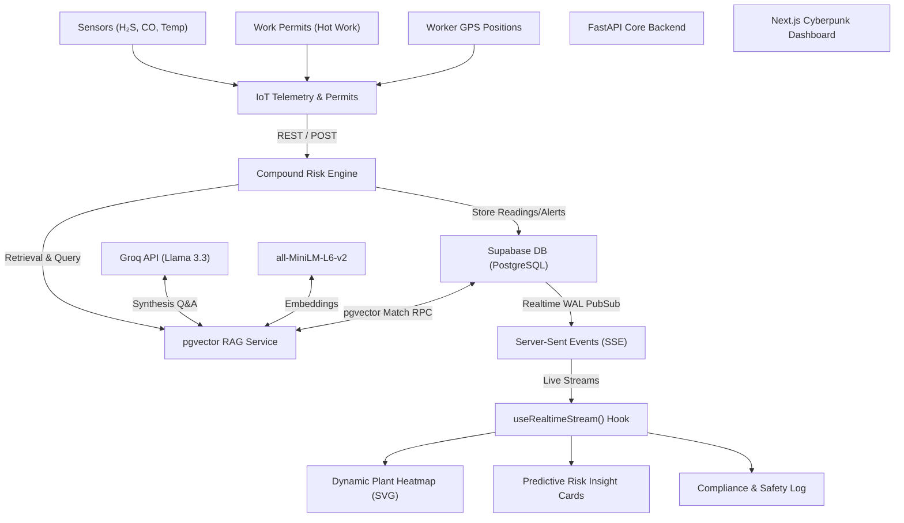
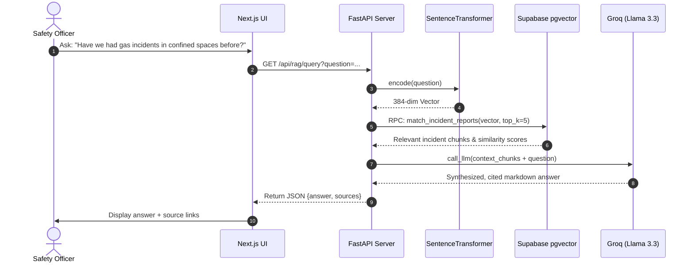

# 🛡️ SentraGrid: Real-Time Compound Risk Intelligence for Industrial Plants

SentraGrid is an advanced, AI-powered industrial safety platform designed to prevent catastrophic plant accidents by identifying **compound risk patterns** that traditional, single-sensor alarms completely miss. 

By unifying real-time gas/temperature telemetry, geospatial worker positions, and active work permits into a centralized intelligence system, SentraGrid eliminates the critical visibility gaps responsible for **73% of plant near-misses** (according to the FICCI Industrial Safety Report).

---

## 🏗️ System Architecture

SentraGrid connects remote physical telemetry and operational metadata to a real-time risk evaluation engine, streaming notifications and AI safety insights straight to the control room.



---

## 🌟 Key Features & Innovations

### 1. Compound Risk Detection Engine
Traditional alarms only trigger when a *single* sensor breaches a critical threshold (e.g., CO > 25 ppm). SentraGrid solves the **"sub-threshold hazard"** problem by correlating multiple telemetry streams:
* Combines **H₂S (7.5 ppm)** + **CO (24 ppm)** + **Active Hot Work Permit** in the same zone.
* Calculates a compound risk score and preempts accidents with an early warning time window.

### 2. Live "What-If" Simulation Sliders
Control room operators can test safety scenarios in real-time. Dragging temperature or toxic gas sliders dynamically updates the zone's risk color on the plant map and triggers immediate compound alerts.

### 3. Multi-Plant Geospatial Swapping
Supports instant geospatial interface switching between:
* **Visakhapatnam Steel Complex (Gas Leak Case Study)**
* **Jamnagar Petrochemical Refinery (Synthetic Profile)**

### 4. Safety Intelligence RAG Chat (pgvector + Llama 3.3)
Allows plant managers to query historical logs and safety standards (OISD, Factory Act) using semantic similarity vector search:


### 5. Compliance Override Log
A transparent compliance ledger showing all active permit overrides, safety justifications, timestamps, and safety officer approvals to prevent undocumented hazardous entries.

---

## 📖 Case Study: The Visakh Complex Incident (2022)
In 2022, concurrent hot-work permits and leaking seals during coke-oven door maintenance caused a toxic gas leak. **Standard alarms failed to sound** because H₂S was at 7.5 ppm (limit 10) and CO was at 24 ppm (limit 25).
* **Without SentraGrid**: Isolated databases and sub-threshold metrics resulted in a critical exposure incident.
* **With SentraGrid**: The compound risk engine detects the concurrent hazards, predicts the leak **35 minutes in advance**, and raises a critical alarm.

---

## 🛠️ Technology Stack

| Layer | Technology | Key Usage |
| :--- | :--- | :--- |
| **Frontend** | React / Next.js (TypeScript) | Cyberpunk UI Dashboard, SSE Stream, Dynamic SVGs |
| **Backend** | FastAPI (Python) | High-performance async routers, SIMOPS simulator |
| **Database** | Supabase (Postgres) | pgvector storage, match RPC, Realtime SSE |
| **Embedding Model** | SentenceTransformer (`all-MiniLM-L6-v2`) | Local 384-dimension semantic vector generation |
| **LLM Orchestration**| Groq API (`llama-3.3-70b-versatile`) | Contextual reasoning, predictive analysis, RAG Q&A |

---

## 📦 Environment Variables Configuration

To run SentraGrid in production mode (`MOCK_MODE=false`), configure these variables in `/backend/.env`:

```ini
SUPABASE_URL=https://your-project.supabase.co
SUPABASE_SERVICE_KEY=your-secret-service-role-key
GROQ_API_KEY=gsk_your-groq-api-key
GROQ_MODEL=llama-3.3-70b-versatile
EMBEDDING_MODEL=all-MiniLM-L6-v2
MOCK_MODE=false
CORS_ORIGINS=http://localhost:3000
```

---

## 🚀 Local Quickstart Guide

### 1. Database Setup
1. Enable the `vector` extension in your Supabase project.
2. Run the SQL schema script in [001_initial_schema.sql](file:///d:/Project/et/sentragrid/backend/migrations/001_initial_schema.sql) in your Supabase SQL Editor to initialize tables and the vector similarity search RPC.

### 2. Backend Installation (Python 3.10+)
```bash
cd backend
python -m venv venv
.\venv\Scripts\activate
pip install -r requirements.txt
python app/seed_db.py  # Seeds the Supabase database with embeddings
python -m uvicorn app.main:app --reload --port 8000
```

### 3. Frontend Installation (Node.js 18+)
```bash
cd frontend
npm install
npm run dev
```
Open **`http://localhost:3000`** in your browser to view the SentraGrid Operations Center.
